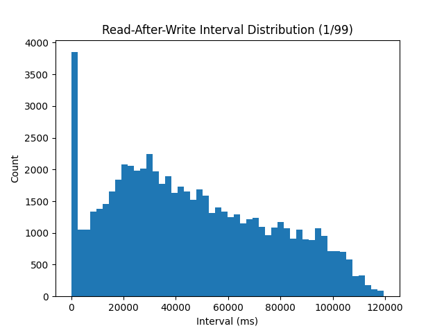

## Intro
The docker-compose.yml hard-code 5 key-value pair nodes. R and W (default to 4) are adjustable in .env file.

### Files
main.go -> Key-Value Service logics
locustfile.py -> Load Test
analyze.py -> Aggregates Result and plotting
Dockerfile -> For building go server image
docker-compos.yml -> Runs kv-services, locust masters and workers


SLA Resiliency Testing is not included in this repo.

## Setup
1) Install Docker and Docker Compose
2) Install pandas and matplotlib if you have not
3) Rename .env.sample to .env 
4) Update READ_RATIO and WRITE_RATIO for each test

Parameters you can tune:
 - READ_RATIO and WRITE_RATIO
 - READ_QUORUM and WRITE_QUORUM -> R and W 
 - USERS -> How many users are sending requests
 - SPAWN_RATE -> How quickly ramp up to full users
 - Runtime -> Total test time
 - wait_time (in locustfile.py) -> time to wait between user requests
 - Number of locust workers, see below on how to use.
 - writeDelay and readDelay in main.go, default set to A4 requirement.

## Build kv-service image
docker build . -t kv-service

## Load Test with Locust

1) Start Key-Value Service and load tests.
```
docker compose up -d --scale locust-worker=6
```
2) Plot results with pandas and matplotlib:
```
python analyze.py
```

You should see aggregated results for your current read/write ratio (e.g. intervals_1_99.png, read_latency_1_99.png, write_lantency_1_99.png)

--- 

To terminate, run:
```
docker compose down
```

## Send requests manually

### POST
curl -i -X POST "http://localhost:8000/put?key=username&value=Alice"

### GET
curl -i "http://localhost:8000/get?key=username"

To observe inconsistency of values across kv nodes, increase the writeDelay (e.g. 5000 ms)

## Results
### Parameters used for tests
 - WRITE_QUORUM=4
 - READ_QUORUM=4
 - NUM_KEYS=100
 - USERS=25
 - SPAWN_RATE=10
 - RUN_TIME=120s 

Defaults in locustfile.py and for docker
 - locust-worker=6 
 - wait_time range between(0.01, 0.05)

### Load Test

1) Interval Comparisons



2) Read Comparisons


3) Write Comparisons


